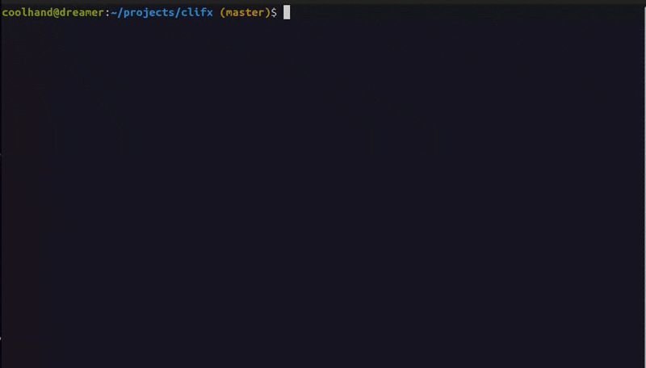
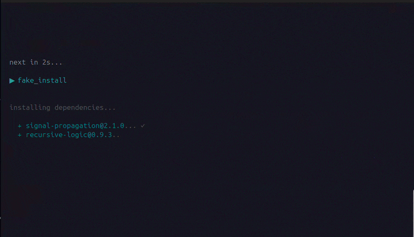
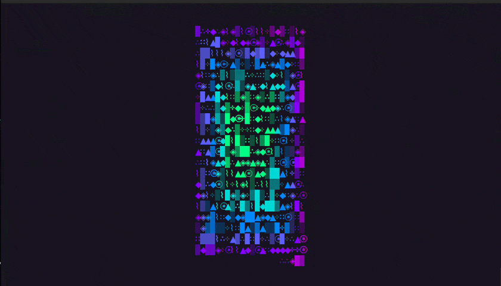

# clifx

Terminal visual effects in pure Bash. A variety of nonsense including glitch washes, matrix rain, screen corruption, typing animations, progress bars, all kinds of text, some crappy boxes I can't get to work, and whatever else came into my tiny mind. Oh, and a player for frame by frame animations, ascii animations, and a gif to terminal converter that works like absolute garbage. All built on ANSI escape codes! 

No dependencies. No build step. Just `source` and go.

[](LICENSE)


---

<p align="center">
  
</p>

---

## Install

```bash
git clone https://github.com/lukeslp/clifx.git
cd clifx
```

Or grab just the parts you need — every file is self-contained once you have `lib/core.sh`.

## Quick Start

```bash
# Interactive TUI — browse effects, voices, animations with speed/color controls
./clifx

# Run any effect directly
./clifx rain 5 15
./clifx glitch 3 2
./clifx chromatic_aberration "SIGNAL LOST" 3

# Text voices
./clifx voice "hello world" whisper
./clifx voice "ALERT" shout
./clifx voice "corrupted data stream" corrupt

# Play a frame animation
./clifx play mini-smallcube 24 1

# Convert a GIF to a terminal animation
./clifx convert explosion.gif -w 40 -ht 20

# List everything
./clifx list
```

---

## Effects

### Core Effects

11 foundational effects: glitch overlays, static noise, screen flicker, bordered frames, typing animations, code corruption, heartbeat pulses, screen transitions, color waves, fake package installs, and scrolling credits.

```bash
./clifx glitch 4 3                    # intensity (1-5), duration (seconds)
./clifx static 2                      # duration
./clifx flicker 5                     # flash count
./clifx styled_frame "SYSTEM ONLINE"
./clifx build_text "Loading..." 25
./clifx corruption "$(cat some_file.sh)"
./clifx heartbeat 5 "◈"              # pulse count, symbol
./clifx transition
./clifx color_wave 3 down             # waves, direction
./clifx fake_install
./clifx credits
```

<p align="center">
  
</p>

### Screen Corruption

5 effects that degrade and distort the display: tearing, scanlines, chromatic aberration, signal noise, and datamosh compression artifacts.

```bash
./clifx screen_tear 3 2              # intensity, duration
./clifx scanlines 3 20               # duration, speed
./clifx chromatic_aberration "SIGNAL LOST" 3
./clifx signal_noise 3 3 30          # intensity, duration, speed
./clifx datamosh 3 3                 # intensity, duration
```

### Spatial Effects

4 effects that fill the screen with movement: matrix rain, spirals, ripple waves, and orbiting symbols.

```bash
./clifx rain 5 15                    # duration, speed
./clifx spiral 10 out                # radius, direction (in/out)
./clifx ripple 3 40                  # waves, speed
./clifx orbit 8 5 "@"                # revolutions, speed, symbol
```

### Theater Effects

3 effects that fake system output: scrolling hex dumps with hidden messages, EKG-style waveforms, and a process listing that progressively corrupts.

```bash
./clifx hex_dump 30 60               # lines, speed
./clifx waveform 5 30                # duration, speed
./clifx process_tree 100             # speed
```

### Atmosphere Effects

5 ambient effects: vignette darkening, plasma fields, breathing patterns, text afterimages, and typewriter text that rewinds and replaces itself.

<p align="center">
  
</p>

```bash
./clifx vignette 4 3
./clifx plasma 4 30
./clifx breathe 4 "░"
./clifx afterimage "hello world"
./clifx typewriter_rewind "i was going to say something" "never mind" 35
```

### Text Voices

6 styles for rendering text with different visual personalities: whisper (dim, slow), speak (bordered), shout (inverted, bold), corrupt (glitch overlays), fragment (scattered), and clear (centered, clean).

```bash
./clifx voice "do you hear that" whisper
./clifx voice "status report" speak
./clifx voice "red alert" shout
./clifx voice "signal degrading" corrupt
./clifx voice "the words kept breaking" fragment
./clifx voice "THE END" clear
```

---

## Animations

### Compact Animations (terminal-friendly)

Designed for standard 80x24 terminals. No cropping needed.

| Animation | Size | Frames | Description |
|-----------|------|--------|-------------|
| `mini-smallcube` | 40x21 | 121 | Rotating 3D cube in block characters |
| `mini-smallspiral` | 40x21 | 15 | Spiral pattern |
| `mini-cube` | 30x16 | 24 | Wireframe cube |
| `mini-spiral` | 30x15 | 20 | Procedural spiral |
| `mini-wave` | 36x14 | 16 | Overlapping sine waves |
| `mini-pulse` | 30x16 | 16 | Expanding/contracting rings |
| `mini-rain` | 35x18 | 20 | Falling matrix drops |
| `mini-spinner` | 14x9 | 12 | Rotating spinner |

```bash
./clifx play mini-smallcube 24 0     # 24 fps, loop forever
./clifx play mini-wave 12 3          # 12 fps, 3 loops
```

### Full-Size Animations

Need large terminals (100+ columns). Automatically center-cropped to fit smaller viewports.

| Animation | Size | Frames |
|-----------|------|--------|
| `gears` | 100x51 | 501 |
| `ironman` | 100x51 | 250 |
| `cube` | 100x51 | 121 |
| `cube-alt` | 160x81 | 121 |
| `bauhaus` | 100x51 | 84 |
| `spiral` | 160x81 | 15 |

### Animation File Format

Frames separated by `--- Frame N ---` delimiters:

```
--- Frame 1 ---
  ╔══╗
  ║  ║
  ╚══╝
--- Frame 2 ---
  ╔══╗
  ║██║
  ╚══╝
```

Drop a `.txt` file into `ascii-animations/` and the TUI picks it up automatically.

---

## GIF/Video Converter

Convert GIF or video files to colored terminal animations. Uses Unicode half-block characters (`▀`) with true-color ANSI — each character cell renders 2 vertical pixels.

```bash
# Convert a GIF (game-ready size)
./clifx convert explosion.gif -w 40 -ht 20

# Custom output name + preview first frame
./clifx convert cutscene.gif -o intro --preview

# Video files (uses ffmpeg)
./clifx convert clip.mp4 -w 50 -ht 25 --max-frames 60

# Tiny sprite with dithering
./clifx convert sprite.gif -w 16 -ht 8 --dither
```

Output lands in `ascii-animations/` as a playable `.txt` file.

Requires Python 3 + Pillow (`pip install Pillow`). Video conversion also needs ffmpeg.

---

## Use as a Library

Source the modules you need in your own scripts:

```bash
source "path/to/clifx/lib/core.sh"
source_lib style terminal text animation progress box divider ascii
source_theme default
```

`core.sh` must be sourced first — it bootstraps the loader. After that, pick what you need.

<details>
<summary><strong>Text Rendering</strong></summary>

```bash
type_text "Initializing system..." 30 "$THEME_GLOW"
center_text "[ STATUS OK ]" "$UI_SUCCESS"
wrap_text "Long string that wraps at word boundaries" 40
truncate_text "A very long status message" 25 "..."
echo "some output" | indent 4
```
</details>

<details>
<summary><strong>Progress Indicators</strong></summary>

```bash
spinner "Compiling assets" make build
progress_bar 7 10 30 "$UI_SUCCESS"
fake_progress "Loading configuration" 2000
checklist_item "Dependencies installed" done
checklist_item "Health check" fail
install_line "express@4.18.2"
```
</details>

<details>
<summary><strong>Box Drawing</strong></summary>

Four border styles: `single`, `double`, `rounded`, `heavy`.

```bash
draw_box_text "Status: OK" rounded "$THEME_FG"
draw_panel single "$THEME_FG" "Line 1" "Line 2" "Line 3"
draw_header "Configuration" thick "$THEME_ACCENT"
draw_box 40 5 double "$UI_INFO"
```
</details>

<details>
<summary><strong>Dividers</strong></summary>

Six line styles: `thin`, `thick`, `double`, `dotted`, `dashed`, `wave`.

```bash
divider thin "$THEME_DIM"
divider wave "$THEME_ACCENT"
divider_text "Section Break" thick "$THEME_FG"
```
</details>

<details>
<summary><strong>Animation Primitives</strong></summary>

```bash
sweep_down 10 "$THEME_DIM" "░"
sweep_up 10
flash_screen 3
pulse "ALERT" 5 "$THEME_GLOW" "$THEME_DIM"
fill_random 50 "$THEME_FG"
```
</details>

<details>
<summary><strong>Style Utilities</strong></summary>

```bash
printf "$(fg 196)Red text$(style_reset)\n"
printf "$(bg 21)Blue background$(style_reset)\n"
printf "$(fg_rgb 255 128 0)Orange from RGB$(style_reset)\n"
printf "${BOLD}Bold${RESET} ${DIM}Dim${RESET} ${ITALIC}Italic${RESET}\n"
printf "${UI_SUCCESS}Success${RESET} ${UI_WARN}Warning${RESET} ${UI_ERROR}Error${RESET}\n"
supports_256_color && echo "256-color supported"
```
</details>

<details>
<summary><strong>Frame Animations</strong></summary>

```bash
source "path/to/clifx/lib/core.sh"
source_lib terminal ascii

play_frames "animation.txt" 12 1              # file, fps, loops (0=infinite)
play_frames "animation.txt" 24 0 "$THEME_FG"  # with color tint
```
</details>

---

## Speed Control

Every timing call goes through `sleep_ms()`, which honors a global multiplier:

```bash
export CLIFX_SPEED_MULT=50   # 2x faster (50% of normal delay)
export CLIFX_SPEED_MULT=200  # 2x slower (200% of normal delay)
```

## Animation Viewport

Constrain the animation viewport independently of terminal size:

```bash
CLIFX_MAX_WIDTH=40 CLIFX_MAX_HEIGHT=20 ./clifx play gears 24 1
```

Frames are center-cropped to fit. Useful for embedding animations in a smaller region of the screen.

## Themes

The default theme is neon green on black. Override with env vars or create a theme file in `theme/`:

```bash
export CLIFX_COLOR_FG='\033[38;5;196m'
export CLIFX_COLOR_GLOW='\033[38;5;196m'
export CLIFX_COLOR_DIM='\033[38;5;52m'
export CLIFX_COLOR_ACCENT='\033[38;5;214m'
```

Theme variables: `THEME_FG`, `THEME_DIM`, `THEME_GLOW`, `THEME_ACCENT`, `THEME_WARN`, `THEME_BG`.

## All Effects

| Category | Effects |
|----------|---------|
| Core | `glitch` `static` `flicker` `styled_frame` `build_text` `corruption` `heartbeat` `transition` `color_wave` `fake_install` `credits` |
| Corruption | `screen_tear` `scanlines` `chromatic_aberration` `signal_noise` `datamosh` |
| Spatial | `rain` `spiral` `ripple` `orbit` |
| Theater | `hex_dump` `waveform` `process_tree` |
| Atmosphere | `vignette` `plasma` `breathe` `afterimage` `typewriter_rewind` |
| Voices | `whisper` `speak` `shout` `corrupt` `fragment` `clear` |
| Animation | `play` (frame player) + `convert` (GIF/video importer) |

## Module Reference

| Module | Functions |
|--------|-----------|
| `core` | `sleep_ms`, `source_lib`, `source_theme`, `random_int`, `random_choice` |
| `style` | `fg`, `bg`, `fg_rgb`, `bg_rgb`, `color_256`, `style_reset`, `supports_256_color`, `supports_truecolor` |
| `terminal` | `hide_cursor`, `show_cursor`, `move_cursor`, `save_cursor`, `restore_cursor`, `clear_screen`, `clear_line`, `center_col` |
| `text` | `type_text`, `center_text`, `pad_text`, `wrap_text`, `truncate_text`, `indent` |
| `animation` | `sweep_down`, `sweep_up`, `pulse`, `flash_screen`, `fill_random`, `clear_sweep` |
| `progress` | `spinner`, `progress_bar`, `fake_progress`, `checklist_item`, `install_line` |
| `box` | `draw_box`, `draw_box_text`, `draw_header`, `draw_panel` |
| `divider` | `divider`, `divider_text`, `blank_lines` |
| `corruption` | `corrupted_install_sequence`, `glitch_wash`, `script_freeze` |
| `ascii` | `render_art`, `render_art_animated`, `assemble_fragments`, `play_frames`, `_crop_frame` |

## Adding Effects

1. Pick the right `scripts/manifest_*.sh` module (or create a new one)
2. Add an include guard: `[[ -n "${_CLIFX_MANIFEST_YOURMOD_LOADED:-}" ]] && return 0`
3. Write your `effect_name()` function — use `hide_cursor`/`show_cursor`, reference `ROWS`/`COLS`
4. Add a dispatch case in `scripts/manifest.sh`
5. Add to `clifx`'s `ALL_EFFECTS` array and `run_effect()` case block

## Adding Animations

Drop a `--- Frame N ---` delimited `.txt` file into `ascii-animations/`. The TUI auto-discovers it. Prefix with `mini-` for the compact category.

Or convert from GIF/video:

```bash
./clifx convert yourfile.gif -w 40 -ht 20 -o yourname
```

## Requirements

- Bash 4+
- A terminal with 256-color support
- Python 3 + Pillow (only for `convert` command)
- That's it

## License

MIT — [Luke Steuber](https://lukesteuber.com)
