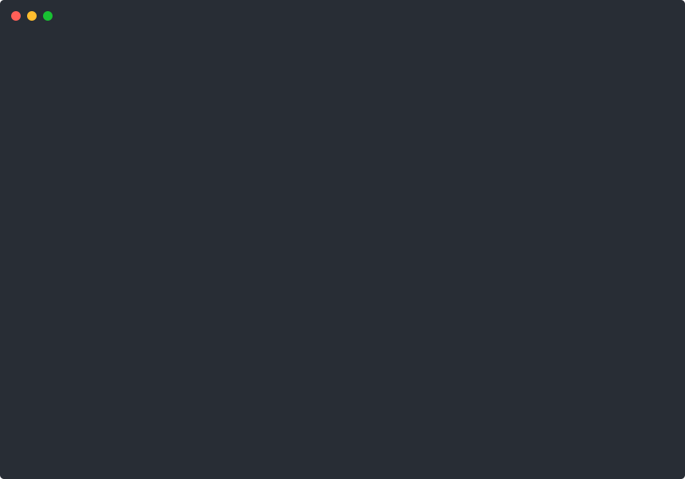

# clifx

Terminal visual effects in pure Bash. Glitch washes, matrix rain, screen corruption, typing animations, progress bars, box drawing — 26 effects and 6 text rendering styles, all built on ANSI escape codes.

No dependencies. No build step. Just `source` and go.

[](LICENSE)

## Install

```bash
git clone https://github.com/lukeslp/clifx.git
```

Or grab just the parts you need — every file is self-contained once you have `lib/core.sh`.

## Quick Start

```bash
# Run any effect directly
bash clifx/scripts/manifest.sh rain
bash clifx/scripts/manifest.sh glitch 3 2
bash clifx/scripts/manifest.sh chromatic_aberration "SIGNAL LOST" 3

# Render text in different styles
bash clifx/scripts/voice.sh "hello world" whisper
bash clifx/scripts/voice.sh "ALERT" shout
bash clifx/scripts/voice.sh "corrupted data stream" corrupt

# Interactive tester — browse all effects with speed/color controls
bash clifx/scripts/tester.sh
```

## Demos

<p align="center">
  
</p>

### Text Effects



```bash
bash scripts/manifest.sh build_text "Something is loading..." 25
bash scripts/manifest.sh styled_frame "SYSTEM ONLINE"
bash scripts/manifest.sh credits
```

### Glitch & Corruption


```bash
# Args: intensity (1-5), duration (seconds)
bash scripts/manifest.sh glitch 4 3
bash scripts/manifest.sh static 2
bash scripts/manifest.sh flicker 5
bash scripts/manifest.sh corruption "$(cat some_file.sh)"
bash scripts/manifest.sh chromatic_aberration "SIGNAL LOST" 3
bash scripts/manifest.sh screen_tear 3 2
bash scripts/manifest.sh scanlines 3 20
bash scripts/manifest.sh signal_noise 3 3 30
bash scripts/manifest.sh datamosh 3 3
```

### Spatial Effects

```bash
# Matrix rain, spirals, ripples, orbiting symbols
bash scripts/manifest.sh rain 5 15
bash scripts/manifest.sh spiral 10 out
bash scripts/manifest.sh ripple 3 40
bash scripts/manifest.sh orbit 8 5 "@"
```

### Theater Effects

```bash
# Fake hex dump, waveform visualization, process tree
bash scripts/manifest.sh hex_dump 30 60
bash scripts/manifest.sh waveform 5 30
bash scripts/manifest.sh process_tree 100
```

### Atmosphere Effects


```bash
bash scripts/manifest.sh vignette 4 3
bash scripts/manifest.sh plasma 4 30
bash scripts/manifest.sh breathe 4 "░"
bash scripts/manifest.sh afterimage "hello world"
bash scripts/manifest.sh heartbeat 5 "◈"
bash scripts/manifest.sh typewriter_rewind "i was going to say something" "never mind" 35
```

### Fake Install


```bash
bash scripts/manifest.sh fake_install
```

### Text Voices

Six styles for rendering text with different visual personalities:


```bash
bash scripts/voice.sh "do you hear that" whisper       # dim, slow, lowercase
bash scripts/voice.sh "status report" speak             # framed with border
bash scripts/voice.sh "red alert" shout                 # inverted, bold, UPPERCASE
bash scripts/voice.sh "signal degrading" corrupt        # random glitch overlays
bash scripts/voice.sh "the words kept breaking" fragment # scattered across lines
bash scripts/voice.sh "THE END" clear                   # centered, bold, clean
```

### Recording Your Own Demos

```bash
# Record all effects as .cast + .svg
bash demos/record.sh

# Record one specific effect
bash demos/record.sh rain

# List available demos
bash demos/record.sh --list

# Convert existing .cast files to SVG
bash demos/record.sh --convert
```

Requires `asciinema` and `svg-term-cli` (`npm install -g svg-term-cli`).

### All Effects

| Category | Effects |
|----------|---------|
| Core | `glitch` `static` `flicker` `styled_frame` `build_text` `corruption` `heartbeat` `transition` `color_wave` `fake_install` `credits` |
| Corruption | `screen_tear` `scanlines` `chromatic_aberration` `signal_noise` `datamosh` |
| Spatial | `rain` `spiral` `ripple` `orbit` |
| Theater | `hex_dump` `waveform` `process_tree` |
| Atmosphere | `vignette` `plasma` `breathe` `afterimage` `typewriter_rewind` |

Run `bash scripts/manifest.sh help` for the full list with arguments.

## Use as a Library

Source the modules you need in your own scripts:

```bash
source "path/to/clifx/lib/core.sh"
source_lib style terminal text animation progress box divider
source_theme default
```

`core.sh` must be sourced first — it bootstraps the loader. After that, pick what you need.

### Text Rendering

```bash
# Character-by-character typing with punctuation pauses
type_text "Initializing system..." 30 "$THEME_GLOW"

# Centered text
center_text "[ STATUS OK ]" "$UI_SUCCESS"

# Word wrap to width
wrap_text "This is a long string that will be wrapped at word boundaries" 40

# Truncate with ellipsis
truncate_text "A very long status message that won't fit" 25 "..."

# Indent a block of text
echo "some output" | indent 4
```

### Progress Indicators

```bash
# Spinner that runs while a command executes
spinner "Compiling assets" make build

# Progress bar (current, total, width, color)
for i in $(seq 1 10); do
    printf "\r"
    progress_bar "$i" 10 30 "$UI_SUCCESS"
    sleep 0.2
done
echo ""

# Fake progress dots
fake_progress "Loading configuration" 2000

# Checklist items
checklist_item "Dependencies installed" done
checklist_item "Config validated" done
checklist_item "Database migration" pending
checklist_item "Health check" fail

# Fake package install line
install_line "express@4.18.2"
install_line "chalk@5.3.0"
```

### Box Drawing

Four border styles: `single`, `double`, `rounded`, `heavy`.

```bash
# Box around text
draw_box_text "Status: OK" rounded "$THEME_FG"
draw_box_text "WARNING: disk full" heavy "$UI_WARN"

# Multi-line panel
draw_panel single "$THEME_FG" "Line 1" "Line 2" "Line 3"

# Header bar with centered title
draw_header "Configuration" thick "$THEME_ACCENT"

# Empty box outline (width, height)
draw_box 40 5 double "$UI_INFO"
```

### Dividers

Six line styles: `thin`, `thick`, `double`, `dotted`, `dashed`, `wave`.

```bash
divider thin "$THEME_DIM"
divider thick "$THEME_FG"
divider wave "$THEME_ACCENT"

# With centered label
divider_text "Section Break" thick "$THEME_FG"
divider_text "Results" double "$UI_SUCCESS"
```

### Animation Primitives

```bash
sweep_down 10 "$THEME_DIM" "░"    # Screen wipe from top
sweep_up 10                        # Screen wipe from bottom
flash_screen 3                     # Flash/reverse whole screen
pulse "ALERT" 5 "$THEME_GLOW" "$THEME_DIM"  # Pulse between bright and dim
fill_random 50 "$THEME_FG"        # Fill screen with random chars
```

### Style Utilities

```bash
# 256-color codes
printf "$(fg 196)Red text$(style_reset)\n"
printf "$(bg 21)Blue background$(style_reset)\n"
printf "$(fg_rgb 255 128 0)Orange from RGB$(style_reset)\n"

# Modifiers
printf "${BOLD}Bold${RESET} ${DIM}Dim${RESET} ${ITALIC}Italic${RESET}\n"
printf "${UNDERLINE}Underline${RESET} ${REVERSE}Reverse${RESET}\n"

# UI semantic colors
printf "${UI_SUCCESS}Success${RESET} ${UI_WARN}Warning${RESET} ${UI_ERROR}Error${RESET}\n"

# Capability detection
supports_256_color && echo "256-color supported"
supports_truecolor && echo "Truecolor supported"
```

## Speed Control

Every timing call goes through `sleep_ms()`, which honors a global multiplier:

```bash
export CLIFX_SPEED_MULT=50   # 2x faster (50% of normal delay)
export CLIFX_SPEED_MULT=200  # 2x slower (200% of normal delay)
```

The interactive tester (`tester.sh`) lets you adjust speed live.

## Themes

The default theme is neon green on black. Override any color with env vars:

```bash
export CLIFX_COLOR_FG='\033[38;5;196m'
export CLIFX_COLOR_GLOW='\033[38;5;196m'
export CLIFX_COLOR_DIM='\033[38;5;52m'
export CLIFX_COLOR_ACCENT='\033[38;5;214m'
bash scripts/manifest.sh rain
```

Or create a theme file in `theme/` following the pattern in `theme/default.sh`.

Theme variables: `THEME_FG`, `THEME_DIM`, `THEME_GLOW`, `THEME_ACCENT`, `THEME_WARN`, `THEME_BG`.

## Module Reference

| Module | Functions |
|--------|-----------|
| `core` | `sleep_ms`, `source_lib`, `source_theme`, `random_int`, `random_choice` |
| `style` | `fg`, `bg`, `fg_rgb`, `bg_rgb`, `color_256`, `style_reset`, `supports_256_color`, `supports_truecolor` |
| `terminal` | `hide_cursor`, `show_cursor`, `move_cursor`, `save_cursor`, `restore_cursor`, `clear_screen`, `clear_line`, `center_col` |
| `text` | `type_text`, `center_text`, `pad_text`, `wrap_text`, `truncate_text`, `indent` |
| `animation` | `sweep_down`, `sweep_up`, `pulse`, `flash_screen`, `fill_random`, `clear_sweep` |
| `progress` | `spinner`, `progress_bar`, `fake_progress`, `checklist_item`, `install_line` |
| `box` | `draw_box`, `draw_box_text`, `draw_header`, `draw_panel` |
| `divider` | `divider`, `divider_text`, `blank_lines` |
| `corruption` | `corrupted_install_sequence`, `glitch_wash`, `script_freeze` |
| `ascii` | `render_art`, `render_art_animated`, `assemble_fragments` |

## Adding Effects

1. Pick the right `scripts/manifest_*.sh` module (or create a new one)
2. Add an include guard: `[[ -n "${_CLIFX_MANIFEST_YOURMOD_LOADED:-}" ]] && return 0`
3. Write your `effect_name()` function — use `hide_cursor`/`show_cursor`, reference `ROWS`/`COLS`
4. Add a dispatch case in `scripts/manifest.sh`
5. Add to `scripts/tester.sh` arrays

## Requirements

- Bash 4+
- A terminal with 256-color support
- That's it

## License

MIT — Luke Steuber
