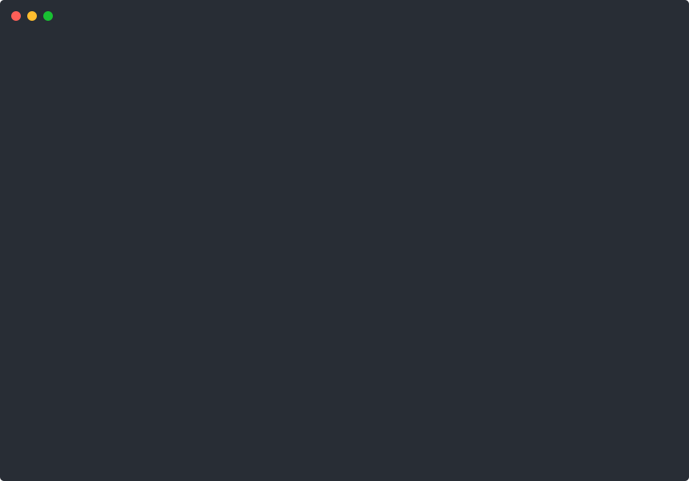

# clifx

Terminal visual effects in pure Bash. Glitch washes, matrix rain, screen corruption, typing animations, progress bars, box drawing — 28 effects, 6 text voices, and a frame animation player, all built on ANSI escape codes.

No dependencies. No build step. Just `source` and go.

[](LICENSE)

---

<p align="center">
  
</p>

---

## Install

```bash
git clone https://github.com/lukeslp/clifx.git
```

Or grab just the parts you need — every file is self-contained once you have `lib/core.sh`.

## Quick Start

```bash
# Run any effect directly
bash clifx/scripts/manifest.sh rain
bash clifx/scripts/manifest.sh glitch 3 2
bash clifx/scripts/manifest.sh chromatic_aberration "SIGNAL LOST" 3

# Render text in different styles
bash clifx/scripts/voice.sh "hello world" whisper
bash clifx/scripts/voice.sh "ALERT" shout
bash clifx/scripts/voice.sh "corrupted data stream" corrupt

# Play a frame animation
bash clifx/scripts/play.sh ascii-animations/spiral.txt 12

# Interactive tester — browse all effects with speed/color controls
bash clifx/scripts/tester.sh
```

---

## Effects

### Core Effects

11 foundational effects: glitch overlays, static noise, screen flicker, bordered frames, typing animations, code corruption, heartbeat pulses, screen transitions, color waves, fake package installs, and scrolling credits.

<p align="center">
  
</p>

```bash
bash scripts/manifest.sh glitch 4 3           # intensity (1-5), duration (seconds)
bash scripts/manifest.sh static 2             # duration
bash scripts/manifest.sh flicker 5            # flash count
bash scripts/manifest.sh styled_frame "SYSTEM ONLINE"
bash scripts/manifest.sh build_text "Loading..." 25
bash scripts/manifest.sh corruption "$(cat some_file.sh)"
bash scripts/manifest.sh heartbeat 5 "◈"      # pulse count, symbol
bash scripts/manifest.sh transition
bash scripts/manifest.sh color_wave 3 down     # waves, direction
bash scripts/manifest.sh fake_install
bash scripts/manifest.sh credits
```

### Screen Corruption

5 effects that degrade and distort the display: tearing, scanlines, chromatic aberration, signal noise, and datamosh compression artifacts.

<p align="center">
  
</p>

```bash
bash scripts/manifest.sh screen_tear 3 2          # intensity, duration
bash scripts/manifest.sh scanlines 3 20           # duration, speed
bash scripts/manifest.sh chromatic_aberration "SIGNAL LOST" 3
bash scripts/manifest.sh signal_noise 3 3 30      # intensity, duration, speed
bash scripts/manifest.sh datamosh 3 3             # intensity, duration
```

### Spatial Effects

4 effects that fill the screen with movement: matrix rain, spirals, ripple waves, and orbiting symbols.

<p align="center">
  
</p>

```bash
bash scripts/manifest.sh rain 5 15      # duration, speed
bash scripts/manifest.sh spiral 10 out  # radius, direction (in/out)
bash scripts/manifest.sh ripple 3 40    # waves, speed
bash scripts/manifest.sh orbit 8 5 "@"  # revolutions, speed, symbol
```

### Theater Effects

3 effects that fake system output: scrolling hex dumps with hidden messages, EKG-style waveforms, and a process listing that progressively corrupts.

<p align="center">
  
</p>

```bash
bash scripts/manifest.sh hex_dump 30 60      # lines, speed
bash scripts/manifest.sh waveform 5 30       # duration, speed
bash scripts/manifest.sh process_tree 100    # speed
```

### Atmosphere Effects

5 ambient effects: vignette darkening, plasma fields, breathing patterns, text afterimages, and typewriter text that rewinds and replaces itself.

<p align="center">
  
</p>

```bash
bash scripts/manifest.sh vignette 4 3
bash scripts/manifest.sh plasma 4 30
bash scripts/manifest.sh breathe 4 "░"
bash scripts/manifest.sh afterimage "hello world"
bash scripts/manifest.sh typewriter_rewind "i was going to say something" "never mind" 35
```

### Text Voices

6 styles for rendering text with different visual personalities: whisper (dim, slow), speak (bordered), shout (inverted, bold), corrupt (glitch overlays), fragment (scattered), and clear (centered, clean).

<p align="center">
  
</p>

```bash
bash scripts/voice.sh "do you hear that" whisper
bash scripts/voice.sh "status report" speak
bash scripts/voice.sh "red alert" shout
bash scripts/voice.sh "signal degrading" corrupt
bash scripts/voice.sh "the words kept breaking" fragment
bash scripts/voice.sh "THE END" clear
```

---

## ASCII Animations

Play frame-by-frame animations from text files. Ships with 5 animations — spirals, gears, cubes, Bauhaus patterns, and more.

```bash
# Play an animation (file, fps, loops)
bash scripts/play.sh ascii-animations/spiral.txt 12
bash scripts/play.sh ascii-animations/gears.txt 24 0    # loop forever
bash scripts/play.sh ascii-animations/cube.txt 15 3     # 3 loops

# Or via manifest
bash scripts/manifest.sh play ascii-animations/bauhaus.txt 10
```

Animation file format — frames separated by `--- Frame N ---` delimiters:

```
--- Frame 1 ---
  ╔══╗
  ║  ║
  ╚══╝
--- Frame 2 ---
  ╔══╗
  ║██║
  ╚══╝
```

| Animation | Frames | Description |
|-----------|--------|-------------|
| `spiral.txt` | 15 | Rotating spiral pattern in block characters |
| `gears.txt` | 501 | Interlocking mechanical gears |
| `cube.txt` | 121 | 3D rotating cube |
| `bauhaus.txt` | 84 | Bauhaus-inspired geometric patterns |
| `ironman.txt` | 250 | Character portrait |

---

## Use as a Library

Source the modules you need in your own scripts:

```bash
source "path/to/clifx/lib/core.sh"
source_lib style terminal text animation progress box divider ascii
source_theme default
```

`core.sh` must be sourced first — it bootstraps the loader. After that, pick what you need.

<details>
<summary><strong>Text Rendering</strong></summary>

```bash
type_text "Initializing system..." 30 "$THEME_GLOW"
center_text "[ STATUS OK ]" "$UI_SUCCESS"
wrap_text "Long string that wraps at word boundaries" 40
truncate_text "A very long status message" 25 "..."
echo "some output" | indent 4
```
</details>

<details>
<summary><strong>Progress Indicators</strong></summary>

```bash
spinner "Compiling assets" make build
progress_bar 7 10 30 "$UI_SUCCESS"
fake_progress "Loading configuration" 2000
checklist_item "Dependencies installed" done
checklist_item "Health check" fail
install_line "express@4.18.2"
```
</details>

<details>
<summary><strong>Box Drawing</strong></summary>

Four border styles: `single`, `double`, `rounded`, `heavy`.

```bash
draw_box_text "Status: OK" rounded "$THEME_FG"
draw_panel single "$THEME_FG" "Line 1" "Line 2" "Line 3"
draw_header "Configuration" thick "$THEME_ACCENT"
draw_box 40 5 double "$UI_INFO"
```
</details>

<details>
<summary><strong>Dividers</strong></summary>

Six line styles: `thin`, `thick`, `double`, `dotted`, `dashed`, `wave`.

```bash
divider thin "$THEME_DIM"
divider wave "$THEME_ACCENT"
divider_text "Section Break" thick "$THEME_FG"
```
</details>

<details>
<summary><strong>Animation Primitives</strong></summary>

```bash
sweep_down 10 "$THEME_DIM" "░"
sweep_up 10
flash_screen 3
pulse "ALERT" 5 "$THEME_GLOW" "$THEME_DIM"
fill_random 50 "$THEME_FG"
```
</details>

<details>
<summary><strong>Style Utilities</strong></summary>

```bash
printf "$(fg 196)Red text$(style_reset)\n"
printf "$(bg 21)Blue background$(style_reset)\n"
printf "$(fg_rgb 255 128 0)Orange from RGB$(style_reset)\n"
printf "${BOLD}Bold${RESET} ${DIM}Dim${RESET} ${ITALIC}Italic${RESET}\n"
printf "${UI_SUCCESS}Success${RESET} ${UI_WARN}Warning${RESET} ${UI_ERROR}Error${RESET}\n"
supports_256_color && echo "256-color supported"
```
</details>

<details>
<summary><strong>Frame Animations</strong></summary>

```bash
source "path/to/clifx/lib/core.sh"
source_lib terminal ascii

play_frames "animation.txt" 12 1        # file, fps, loops (0=infinite)
play_frames "animation.txt" 24 0 "$THEME_FG"  # with color tint
```
</details>

---

## Speed Control

Every timing call goes through `sleep_ms()`, which honors a global multiplier:

```bash
export CLIFX_SPEED_MULT=50   # 2x faster (50% of normal delay)
export CLIFX_SPEED_MULT=200  # 2x slower (200% of normal delay)
```

## Themes

The default theme is neon green on black. Override with env vars or create a theme file in `theme/`:

```bash
export CLIFX_COLOR_FG='\033[38;5;196m'
export CLIFX_COLOR_GLOW='\033[38;5;196m'
export CLIFX_COLOR_DIM='\033[38;5;52m'
export CLIFX_COLOR_ACCENT='\033[38;5;214m'
```

Theme variables: `THEME_FG`, `THEME_DIM`, `THEME_GLOW`, `THEME_ACCENT`, `THEME_WARN`, `THEME_BG`.

## All Effects

| Category | Effects |
|----------|---------|
| Core | `glitch` `static` `flicker` `styled_frame` `build_text` `corruption` `heartbeat` `transition` `color_wave` `fake_install` `credits` |
| Corruption | `screen_tear` `scanlines` `chromatic_aberration` `signal_noise` `datamosh` |
| Spatial | `rain` `spiral` `ripple` `orbit` |
| Theater | `hex_dump` `waveform` `process_tree` |
| Atmosphere | `vignette` `plasma` `breathe` `afterimage` `typewriter_rewind` |
| Voices | `whisper` `speak` `shout` `corrupt` `fragment` `clear` |
| Animation | `play` (frame player) |

## Module Reference

| Module | Functions |
|--------|-----------|
| `core` | `sleep_ms`, `source_lib`, `source_theme`, `random_int`, `random_choice` |
| `style` | `fg`, `bg`, `fg_rgb`, `bg_rgb`, `color_256`, `style_reset`, `supports_256_color`, `supports_truecolor` |
| `terminal` | `hide_cursor`, `show_cursor`, `move_cursor`, `save_cursor`, `restore_cursor`, `clear_screen`, `clear_line`, `center_col` |
| `text` | `type_text`, `center_text`, `pad_text`, `wrap_text`, `truncate_text`, `indent` |
| `animation` | `sweep_down`, `sweep_up`, `pulse`, `flash_screen`, `fill_random`, `clear_sweep` |
| `progress` | `spinner`, `progress_bar`, `fake_progress`, `checklist_item`, `install_line` |
| `box` | `draw_box`, `draw_box_text`, `draw_header`, `draw_panel` |
| `divider` | `divider`, `divider_text`, `blank_lines` |
| `corruption` | `corrupted_install_sequence`, `glitch_wash`, `script_freeze` |
| `ascii` | `render_art`, `render_art_animated`, `assemble_fragments`, `play_frames` |

## Adding Effects

1. Pick the right `scripts/manifest_*.sh` module (or create a new one)
2. Add an include guard: `[[ -n "${_CLIFX_MANIFEST_YOURMOD_LOADED:-}" ]] && return 0`
3. Write your `effect_name()` function — use `hide_cursor`/`show_cursor`, reference `ROWS`/`COLS`
4. Add a dispatch case in `scripts/manifest.sh`
5. Add to `scripts/tester.sh` arrays

## Recording Demos

```bash
bash demos/record.sh             # Record all demos
bash demos/record.sh core        # Record one specific demo
bash demos/record.sh --list      # List available demos
bash demos/record.sh --convert   # Convert .cast files to SVG
```

Requires `asciinema` and `svg-term-cli` (`npm install -g svg-term-cli`).

## Requirements

- Bash 4+
- A terminal with 256-color support
- That's it

## License

MIT — Luke Steuber
